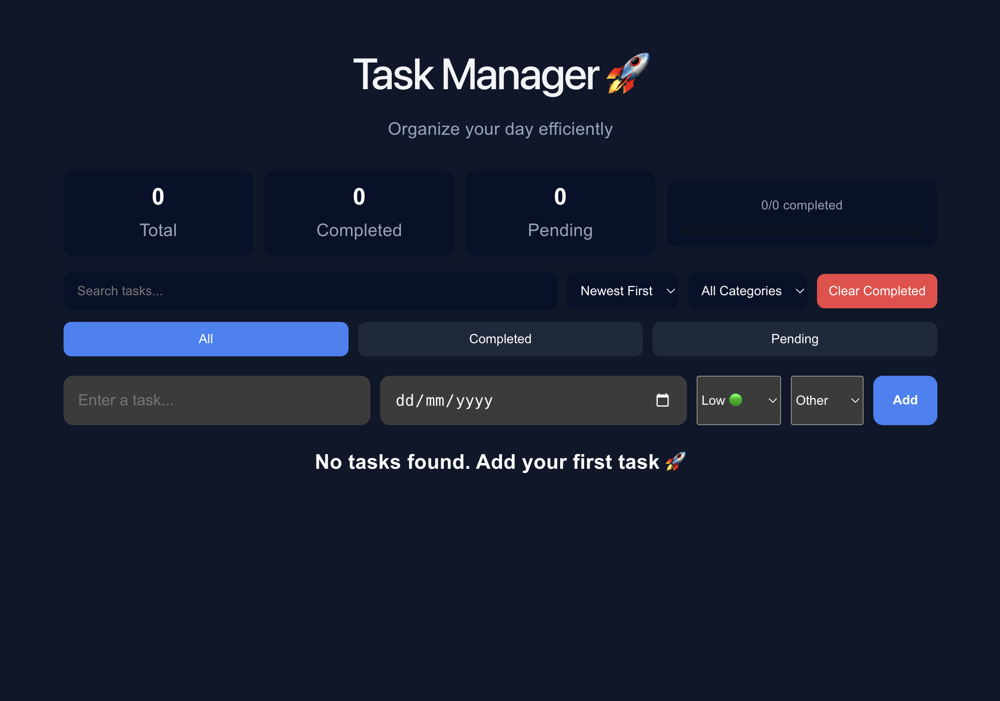
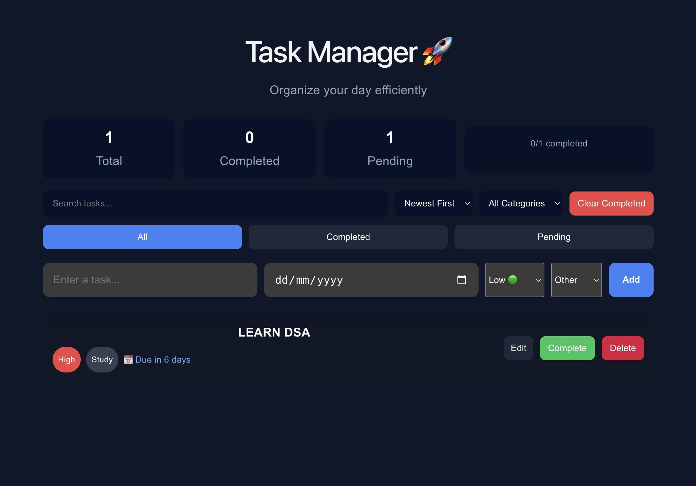
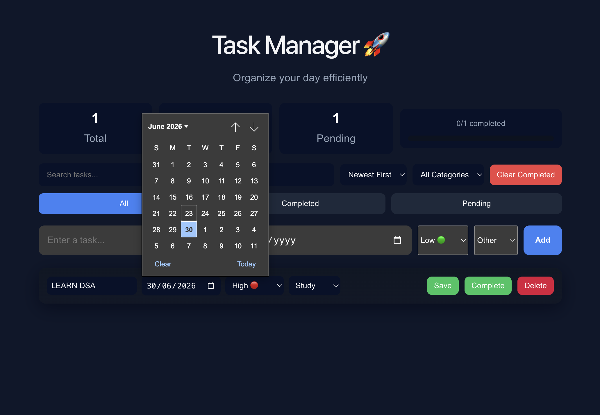
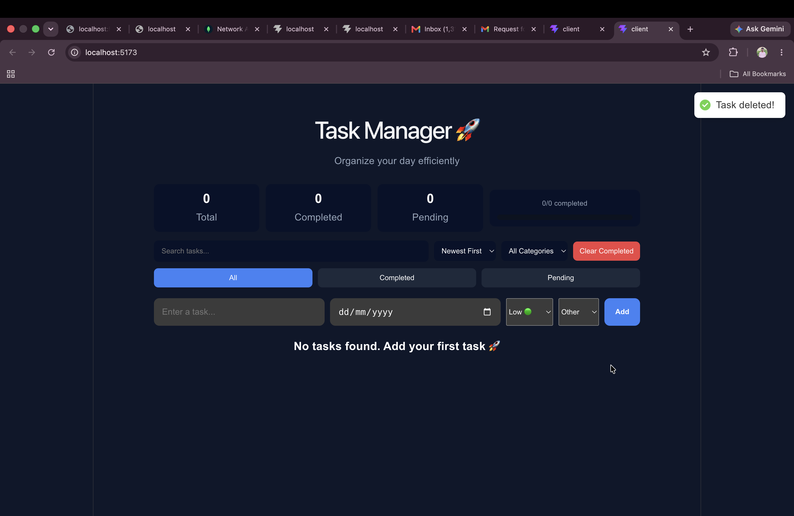

# Task Manager

A Full Stack Task Management Application built using React, Node.js, Express.js, and MongoDB.

## Features

- Add Tasks
- Edit Tasks
- Delete Tasks
- Mark Tasks as Completed
- Statistics Dashboard
- MongoDB Database Storage
- Responsive User Interface

## Project Structure

```
Task-Manager/
│
├── client/      # React Frontend
├── server/      # Node.js + Express Backend
├── screenshots/
└── README.md
```

## Tech Stack

### Frontend
- React.js
- Vite
- CSS

### Backend
- Node.js
- Express.js
- MongoDB
- Mongoose

## Installation

### 1. Clone Repository

```bash
git clone https://github.com/charankoya8/Task-Manager.git
cd Task-Manager
```

### 2. Backend Setup

```bash
cd server
npm install
```

Create a `.env` file inside the `server` folder:

```env
MONGO_URI=your_mongodb_connection_string
PORT=5000
```

Start the backend:

```bash
npm start
```

Backend runs on:

```text
http://localhost:5000
```

### 3. Frontend Setup

Open a new terminal:

```bash
cd client
npm install
npm run dev
```

Frontend runs on:

```text
http://localhost:5173
```

## Screenshots

### Home Page



### Add Task



### Edit Task



### Delete Task



## Author

Charan Koya
